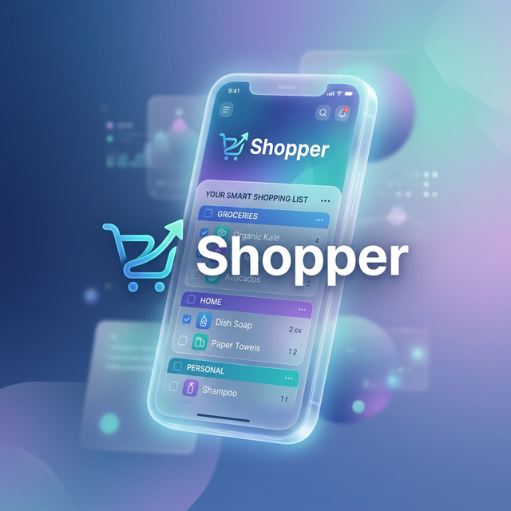

# Shopper 🛒



Shopper is a modern, glassmorphism-styled shopping list application built with React and Node.js. It features AI-powered item identification, barcode scanning, and a "Store Mode" optimized for one-handed use while shopping.

## Features

- **Store Mode**: Optimized UI for in-store shopping with large touch targets.
- **AI Identification**: Snap a photo or upload an image to identify items via Google Gemini.
- **Barcode Scanning**: Quickly add items by scanning their barcodes.
- **Cross-Device Sync**: Real-time updates across multiple devices using WebSockets.
- **Glassmorphism UI**: Beautiful, premium design that feels state-of-the-art.

## Quick Start

### 1. Clone and Run (Recommended)
The easiest way to get started is to clone the repository and use Docker Compose:

```bash
git clone https://github.com/wyliebutler/shopper.git
cd shopper
docker-compose up -d
```

### 2. Run Single Container
Alternatively, you can run the image directly from GHCR:

```bash
docker run -d \
  -p 9001:9001 \
  -e SHOPPER_PASSWORD=your_password \
  -e GEMINI_API_KEY=your_gemini_key \
  -v shopper_data:/app/server/data \
  -v shopper_uploads:/app/server/uploads \
  --name shopper \
  ghcr.io/wyliebutler/shopper:latest
```

### Environment Variables

| Variable | Description |
| --- | --- |
| `SHOPPER_PASSWORD` | The password required to log in to the app. |
| `GEMINI_API_KEY` | Optional. Your Google Gemini API key for image identification. |
| `PORT` | Optional. The port the server runs on (internal default is 9001). |

## Development

1. Clone the repository.
2. Install dependencies in both `client` and `server` directories.
3. Run `npm run dev` in both directories.

## License

MIT
